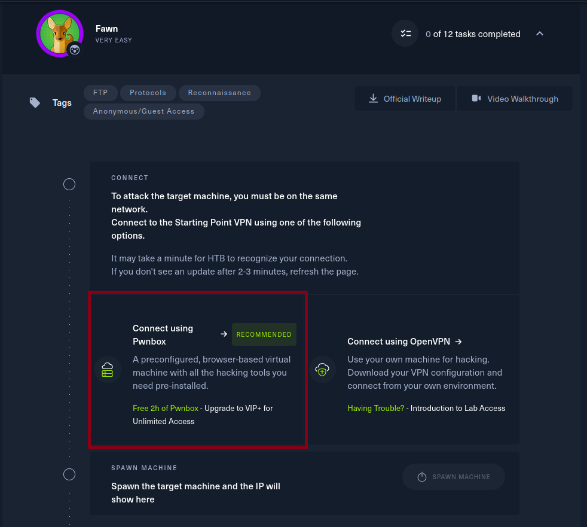
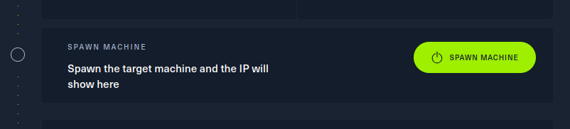
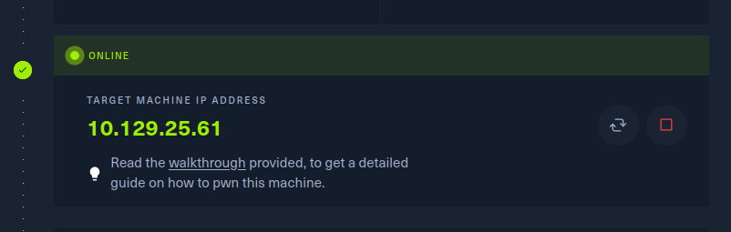
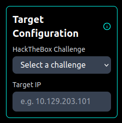

# Run DarkCircuit Locally and Build Native Executable
This guide explains the steps to develop and test the DarkCircuit app locally and to build into a native executable.

## Prerequisites
- Must perform all terminal commands from `/root/exe_build` directory of this repository.

## Initial Setup
### Step 1: Install Requirements
Create `Conda` environment and install requirements:
```bash
pip install -r requirements.txt
```

### Step 2: Install Frontend Dependencies
If not having js installed, install npm/node.js from https://nodejs.org/en -- > https://github.com/coreybutler/nvm-windows/releases
```bash
nvm install lts
```
Then use the latest version printed from the previous command:
```bash
nvm use <latest-version>
```

Install npm dependencies for frontend:
```bash
cd frontend && npm install && cd ..
```

### Step 3: Create Environment File
Insert your OpenAI API key where it is indicated in the command below:
```bash
echo 'OPENAI_API_KEY=<API-Key>' > .env
```

## Frontend Development
Any changes to the frontend must be done using the files are located in `/root/exe_build/frontend`. For any alterations to take effect, you must run the following command to build the React frontend:
```bash
cd frontend && npm run build && cd ..
```

## Backend Development & Testing
Any changes to the backend must be done using the Python scripts located in `/root/exe_build/`.

## Using the App
### Running the App Locally
Execute the following command to run your DarkCircuit app locally:
```bash
python local_app.py
```

> [!TIP]
> Click on `http://127.0.0.1:8000` when it appears in the terminal after you run the above command. 
### Connect to HackTheBox


1. Go to [HackTheBox](https://app.hackthebox.com/starting-point) platform, navigate to `Starting Point`, and select a challenge.


2. Click on `Connect using Pwnbox`, then click `START PWNBOX`, and select dropdown menu `VIEW INSTANCE DETAILS`.
> [!WARNING]
> The HTB Free Plan only provides 2 hrs of Pwnbox usage so be diligent about terminating the instance when you are finished using it.

> [!TIP]
> You can receive **24 hours per month** of Pwnbox usage with a [VIP subscription](https://app.hackthebox.com/vip) or **Unlimited hours** of Pwnbox usage with a [VIP+ subscription](https://app.hackthebox.com/vip). **Make sure to click the billed monthly toggle or you will be charged for annual billing!**

3. Once they appear, copy and paste credentials from the Pwnbox instance into terminal connection window of the DarkCircuit app and click `Connect`.


### Spawn Target Machine
Click on `Spawn Machine` button in the challenge.


### Set Target Configurations

Copy the target IP address as soon as the machine is online and paste in it in the `IP Address` field of the `Target Configuration` area of the sidebar. You can also select the challenge you have chosen on the HackTheBox platform in the `HackTheBox Challenge` dropdown menu in `Target Configurations` which will indicate to the agent where it should look in its RAG for appropriate documentation on completing the task.

> [!CAUTION]
> Agent will not be able to perform any action on the target maching unless an `IP Address` is either entered into the corresponding field in `Target Configuration` or included in the users query.

> [!TIP]
> Sometimes the agent performs better when no challenge is selected in the `HackTheBox Challenge` dropdown menu.

### Start Prompting the Agent
You can go through the questions in the HackTheBox challenge by asking the questions to the agent. Or you can prompt it to get the flag by saying something like:
```bash
Can you get the flag and tell me what it is?
```

> [!INFO]
>You can try out different OpenAI models and system prompts easily by clicking the `AI Configuration` button in the Chat Interface without having make backend changes. You can permanently change the app's default system prompts by editing `/exe_build/frontend/public/prompts.json` and [re-building the frontend](#frontend-development).


## Building a Native Executable
You can build out the app into a native executable by running the corresponding command to your OS. After the build has completed you can run the executable at `/root/dist/DarkCircuit/`.
### Linux/Mac Build
```bash
pyinstaller DarkCircuit_Linux.spec
```

### Windows Build
```powershell
pyinstaller DarkCircuit_Windows.spec
```