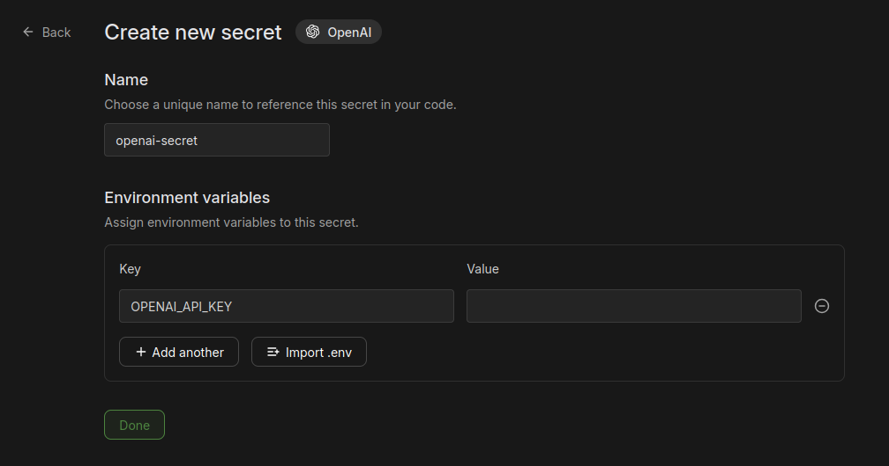

# Deploying DarkCircuit on Modal

This guide explains the steps to deploy and configure the DarkCircuit app on Modal.

## Prerequisites
- Modal account ([https://modal.com](https://modal.com))

> [!TIP]
> Enter card payment details to receive $30/month (USD) of free credits.


## Step-by-Step Deployment & Setup

### Step 1: Navigate to the `full-modal-deployment` directory
In your terminal, navigate to the `/full-modal-deployment` directory of this repository.
```bash
cd full-modal-deployment/
```

### Step 2: Install Requirements & Setup Modal Environment
Make sure your Modal environment is correctly configured. Install Modal CLI if you haven't:
```bash
pip install -r requirements.txt
modal setup
```

### Step 3: Install Frontend Dependencies
If not having js installed, install npm/node.js from https://nodejs.org/en -- > https://github.com/coreybutler/nvm-windows/releases
```bash
nvm install lts
```
Then use the latest version printed from the previous command:
```bash
nvm use <latest-version>
```

Install npm dependencies for frontend:
```bash
cd frontend && npm install && cd ..
```

### Step 4: Create Environment File
1. In the top left corner of your Modal dashboard, find your workspace name.


2. Insert name where it is indicated on each line in the command below:
```bash
echo 'VITE_BACKEND_API_URL=https://<replace-with-workspace-name>--darkcircuit-app-serve.modal.run' > frontend/.env
```
```bash
echo 'VITE_TERMINAL_WS_URL=wss://<replace-with-workspace-name>--darkcircuit-app-serve.modal.run' >> frontend/.env
```

### Step 5: Create OpenAI API Secret on Modal
> [!CAUTION]
> App can run without performing this step but the user won't be able to use the LLM side.
1. In the top left corner of your Modal dashboard select `Secrets`.
2. Click `Create new secret` button.
3. Under `Choose Type` select `OpenAI`.

4. Paste OpenAI API key in the `Value` field and click `Done` button.


### Step 6: Build Frontend
Run the following command to build React frontend:
```bash
cd frontend && npm run build && cd ..
```

### Step 7: Deploy DarkCircuit App
Run the following command from your terminal to deploy your DarkCircuit app to Modal:
```bash
modal deploy darkcircuit_app.py
```

### Step 8: Connect to HackTheBox


1. Go to [HackTheBox](https://app.hackthebox.com/starting-point) platform, navigate to `Starting Point`, and select a challenge.


2. Click on `Connect using Pwnbox`, then click `START PWNBOX`, and select dropdown menu `VIEW INSTANCE DETAILS`.
> [!WARNING]
> The HTB Free Plan only provides 2 hrs of Pwnbox usage so be diligent about terminating the instance when you are finished using it.

> [!TIP]
> You can receive **24 hours per month** of Pwnbox usage with a [VIP subscription](https://app.hackthebox.com/vip) or **Unlimited hours** of Pwnbox usage with a [VIP+ subscription](https://app.hackthebox.com/vip). **Make sure to click the billed monthly toggle or you will be charged for annual billing!**


3. Once you see that the `INSTANCE LIFETIME` has started, copy and paste details from the Pwnbox instance into terminal connection window of the DarkCircuit app and click `Connect`.


> [!CAUTION]
> SSH Terminal will not connect until Pwnbox's `INSTANCE LIFETIME` clock has started.

### Step 9: Experimentation
You can try out different OpenAI models and system prompts easily by clicking the `AI Configuration` button in the Chat Interface without having to re-deploy the app. You can permanently change the app's default system prompts by editing `/full-modal-deployment/frontend/public/prompts.json` and re-doing [Step 6](#step-6-build-frontend) and [Step 7](#step-7-deploy-darkcircuit-app).


## Future Development
Any changes made to incorporate these things should probably be made to `darkcircuit_app.py` or `darkcircuit_agent.py`. To re-deploy after changes just delete the `DarkCircuit` app using the Modal dashboard and re-run the command in [Step 7](#step-7-deploy-darkcircuit-app).