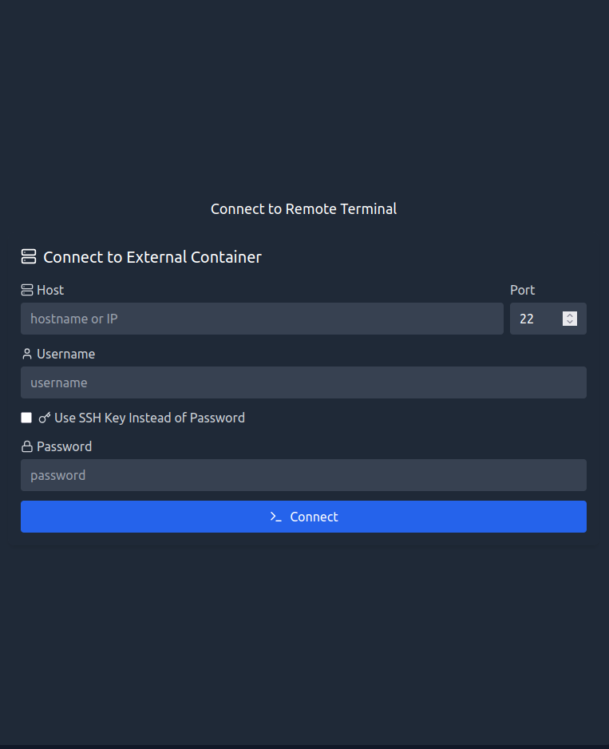

# Deploying DarkCircuit on Modal

This guide explains the steps to deploy and configure the DarkCircuit app on Modal.

## Prerequisites
- Modal account ([https://modal.com](https://modal.com))

> [!TIP]
> Enter card payment details to receive $30/month (USD) of free credits.


## Step-by-Step Deployment & Setup

### Step 1: Navigate to the `full-modal-deployment` directory
In your terminal, navigate to the `/full-modal-deployment` directory of this repository.
```bash
cd full-modal-deployment/
```

### Step 2: Install Requirements & Setup Modal Environment
Make sure your Modal environment is correctly configured. Install Modal CLI if you haven't:
```bash
pip install -r requirements.txt
modal setup
```

### Step 3: Install Frontend Dependencies
Install npm dependencies for frontend:
```bash
cd frontend && npm install && cd ..
```

### Step 4: Deploy Ollama Server
Run the following command from your terminal to deploy your Ollama server to Modal:
```bash
modal deploy ollama_server.py
```

> [!INFO]
> You can set your GPU configuration in `ollama_server.py` by changing `GPU = "T4"`(cheapest GPU) to something faster such as `GPU = "A10G"`(will be a little bit more expensive).

### Step 5: Create Environment File
1. In the top left corner of your Modal dashboard, find your workspace name.


2. Insert name where it is indicated on each line in the command below:
```bash
echo 'VITE_BACKEND_API_URL=https://<replace-with-workspace-name>--darkcircuit-app.modal.run
VITE_TERMINAL_WS_URL=wss://<replace-with-workspace-name>--darkcircuit-app.modal.run' > frontend/.env
```

### Step 6: Build Frontend
Run the following command to build React frontend:
```bash
cd frontend && npm run build && cd ..
```

### Step 7: Deploy DarkCircuit App
Run the following command from your terminal to deploy your DarkCircuit app to Modal:
```bash
modal deploy darkcircuit_app.py
```

### Step 8: Connect to HackTheBox


1. Go to [HackTheBox](https://app.hackthebox.com/starting-point) platform, navigate to `Starting Point`, and select a challenge.


2. Click on `Connect using Pwnbox`, then click `START PWNBOX`, and select dropdown menu `VIEW INSTANCE DETAILS`.
> [!WARNING]
> The HTB Free Plan only provides 2 hrs of Pwnbox usage so be diligent about terminating the instance when you are finished using it.

> [!TIP]
> You can receive **unlimited** Pwnbox usage with a [Student Subscription](https://help.hackthebox.com/en/articles/5720974-academy-subscriptions) at a discounted price of $8/month (USD). Details on how to obtain a Student Subscription are found [here](https://help.hackthebox.com/en/articles/7973133-getting-the-student-subscription).


3. Once you see that the `INSTANCE LIFETIME` has started, copy and paste details from the Pwnbox instance into terminal connection window of the DarkCircuit app and click `Connect`.



> [!CAUTION]
> SSH Terminal will not connect until Pwnbox's `INSTANCE LIFETIME` clock has started.


## Future Development
At the moment, the Ollama LLMs do not have RAG or are able to interact directly with the Pwnbox instance. The [Coding Agent example](https://modal.com/docs/examples/agent) on Modal's documentation may be a good starting point for integrating these concepts into the current implementation. Instead of the sandbox container, DarkCircuit has a connection with a Pwnbox instance. As such, the `run_ssh_command()` method in `darkcircuit_app.py` could be used instead of the `run()` method defined in `agent.py` of Modal's [repo](https://github.com/modal-labs/modal-examples/tree/main/13_sandboxes/codelangchain) by the agent to run code. Any changes made to incorporate these things should probably be made to `darkcircuit_app.py`. To re-deploy after changes just delete the `DarkCircuit` app using the Modal dashboard and re-run the command in [Step 7](#step-7-deploy-darkcircuit-app).