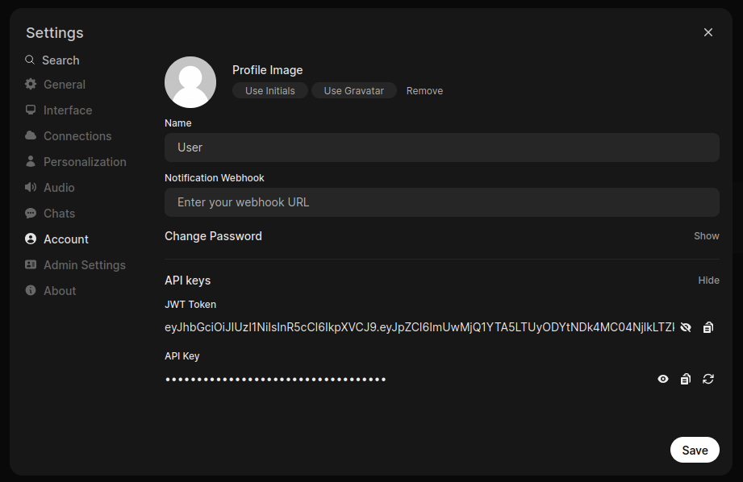
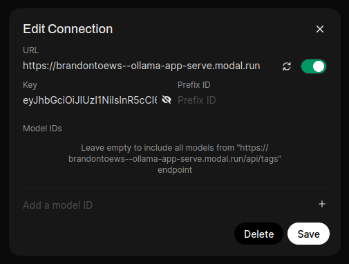

# Deploying Ollama Server on Modal using FastAPI

This guide explains the steps to deploy an Ollama server on Modal using the provided FastAPI script.

## Prerequisites
- Modal account ([https://modal.com](https://modal.com))

## Step-by-Step Deployment

### Step 1: Navigate to the `modal_ollama_deployment` directory
In your terminal, navigate to the `/modal_ollama_deployment` directory of this repository.

### Step 2: Setup Modal Environment
Make sure your Modal environment is correctly configured. Install Modal CLI if you haven't:
```bash
pip install modal
modal setup
```

### Step 3: Grab JWT Token from you OpenWebUI container
Run an OpenWebUI container, navigate to `Settings` > `Account`, click on `Show` under "API keys", and copy the JWT Token.


### Step 4: Configure Authentication
Set your Ollama API key as a Modal secret named `ollama-secret` and set as the copied JWT Token:
```bash
modal secret create ollama-secret OLLAMA_API_KEY=<your-JWT-Token>
```

### Step 5: Set Up Modal Configuration (Optional)
In your Modal app, you can set your GPU configuration in `modal_ollama_server.py` by changing `GPU = "T4"`(cheapest GPU) to something faster such as `GPU = "A10G"`(will be a little bit more expensive).


### Step 6: Deploy Your Server
Run the following command from your terminal to deploy your Ollama server to Modal:
```bash
modal deploy modal_ollama_server.py
```

### Step 5: Connect OpenWebUI
In OpenWebUI, navigate to `Settings` > `Admin Settings` > `Connections` then:
1. Ensure `Ollama API` toggle is on
2. Click on the `+` beside `Manage Ollama API Connections` 
3. Set the `URL` field as the web endpoint link from the server deployment results.
3. Set the `API` field as your JWT Token from [Step 3]((#step-3-grab-jwt-token-from-you-openwebui-container))



### Troubleshooting
- Monitor container logs:
```bash
docker logs open-webui
```

Your Ollama server on Modal is now ready for use!

